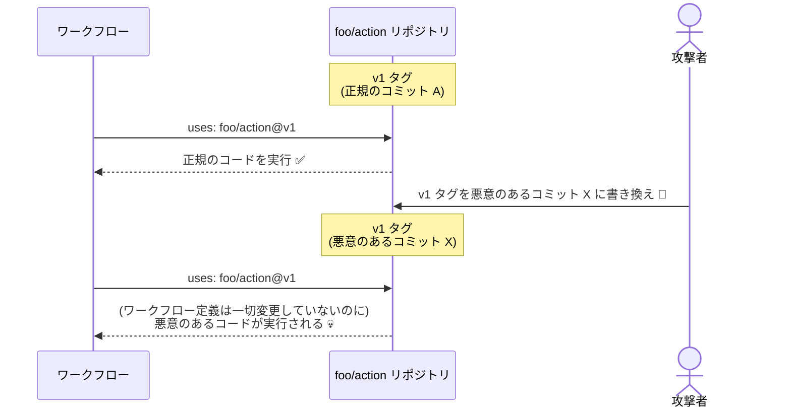

```yaml
# 論外
- uses: foo/action@v1
- uses: foo/action@main

# 危ない
- uses: foo/action@v1.0.0

# まぁ大丈夫
- uses: foo/action@a1b2c3d4e5f6a7b8c9d0e1f2a3b4c5d6e7f8a9b0 # v1.0.0
```

# 要約

- アクションを Git タグやブランチで指定しないでください。
- [pinact](https://github.com/suzuki-shunsuke/pinact) をインストールしてください。
- `pinact run` を実行してください。

```bash
$ pinact run
```

# なんで Git タグやブランチ指定ではダメなの？

基本的に Git タグやブランチは**書き換え可能**だからです。

もしも万が一アクション側のリポジトリが侵害された場合などに、アクションの利用者側は自身の GitHub Actions ワークフロー定義を**何も変更していないのに**突然 CI が壊れたり、**悪意のあるコードが実行される**などのリスクがあります。

例えば以下のようにアクションを参照している場合、もしも攻撃者によって `foo/action` リポジトリの v1 タグが書き換えられたときに**アクション利用者側の GitHub Actions ワークフロー上で**悪意のあるコードが実行されます。

```yaml
- uses: foo/action@v1 # Git タグで指定
```



詳しくは以下の記事を読んでください。

https://zenn.dev/shunsuke_suzuki/articles/pinact-pin-github-actions-version

> GitHub Actions の action のバージョンの指定には branch や tag を用いる事ができます。
> ...
> しかしこれらの branch や tag の commit hash は immutable ではなく、実行タイミングによって実行される action が変わる可能性があります。そのため、コードを修正していないのに突然 CI が壊れたり悪意のあるコードが実行されてしまうリスクがあります。
> > [pinact - GitHub Actions のバージョンを commit hash で固定](https://zenn.dev/shunsuke_suzuki/articles/pinact-pin-github-actions-version#%E8%83%8C%E6%99%AF)

# どうしたらいいの？

利用するバージョンの**コミット SHA を指定してください**。

```yaml
# こんな感じ
- uses: foo/action@a1b2c3d4e5f6a7b8c9d0e1f2a3b4c5d6e7f8a9b0 # v1.0.0
```

コミット SHA は Git タグやブランチとは違って immutable なので、参照先のアクションの変更による想定外の影響を受けるリスクを軽減することができます。

とはいえ、いちいちアクションのコミット SHA を確認するのは大変なので、前述した Shunsuke Suzuki さんの記事で紹介されている [pinact](https://github.com/suzuki-shunsuke/pinact) を使いましょう。

https://github.com/suzuki-shunsuke/pinact

```bash:Homebrew でのインストール例
$ brew install pinact
```

`pinact run` を実行するだけで、Git タグやブランチ指定のアクションをコミット SHA 指定に自動変換してくれます。

```bash
$ pinact run
```

```diff yaml:.github/workflows/example.yml
 # ...

 jobs:
   example:
     runs-on: ubuntu-latest
     steps:
-      - uses: actions/checkout@v6
+      - uses: actions/checkout@de0fac2e4500dabe0009e67214ff5f5447ce83dd # v6.0.2

       # ...
```

# コミット SHA 指定を強制する

リポジトリ設定でアクションのコミット SHA 指定を強制することもできます。

https://github.blog/changelog/2025-08-15-github-actions-policy-now-supports-blocking-and-sha-pinning-actions/


_Require actions to be pinned to a full-length commit SHA_

この設定を有効にしておくと、コミット SHA で固定されていないアクションを参照しているワークフローは実行時にエラーになります。


_GitHub Actions の実行ログ_

> Error: The action actions/checkout@v6 is not allowed in <OWNER>/<REPO> because all actions must be pinned to a full-length commit SHA.

https://zenn.dev/shunsuke_suzuki/articles/github-actions-enforce-sha-pinning

# お客様の声

- [「Git タグの書き換えなんて実際に起こるの？」](#「git-タグの書き換えなんて実際に起こるの？」)
- [「でもメジャーバージョンタグの指定は便利じゃん」](#「でもメジャーバージョンタグの指定は便利じゃん」)
- [「アップデートがめんどくさい」](#「アップデートがめんどくさい」)
- [「Immutable Releases が有効になってればいいじゃん」](#「immutable-releases-が有効になってればいいじゃん」)
- [「コミット SHA を間違えてしまったとき、見分けがつかない」](#「コミット-sha-を間違えてしまったとき、見分けがつかない」)

## 「Git タグの書き換えなんて実際に起こるの？」

「_**確かに理屈として起こりうるのはわかるけど、実際に有名リポジトリの Git タグやブランチが悪意を持って書き換えられることなんてないでしょ？**_」

たまたまこんな記事を見かけましたので貼っておきますね。

https://www.wiz.io/blog/new-github-action-supply-chain-attack-reviewdog-action-setup
https://semgrep.dev/blog/2025/popular-github-action-tj-actionschanged-files-is-compromised/

:::message

(2026/03/21 追記)
Trivy のアクションもやられましたね。

- [Trivy Compromised a Second Time - Malicious v0.69.4 Release, aquasecurity/setup-trivy, aquasecurity/trivy-action GitHub Actions Compromised - StepSecurity](https://www.stepsecurity.io/blog/trivy-compromised-a-second-time---malicious-v0-69-4-release)

:::

## 「でもメジャーバージョンタグの指定は便利じゃん」

「_**`@v1` みたいに指定しておけば、何もしなくてもマイナー / パッチバージョンのアップデートが勝手に適用されていくから便利じゃん！！**_」

そういうことでしたら、プロダクトの依存ライブラリ等も全て勝手にアップデートされていった方が絶対に便利なので、たとえば**毎日自動で依存ライブラリのバージョンを勝手にアップデートして main ブランチに直接 commit & push する** GitHub Actions ワークフローを作ってみるといいかもしれませんね。

えぇ！？！？「_**それはさすがに危ないからやりたくない**_」ですって！？！？
「_**たとえマイナー / パッチバージョンアップデートであっても、破壊的変更や脆弱性の混入などが発生する可能性は決してゼロではない**_」ですって！？！？！？！？
えぇ〜〜〜〜〜っっっ！？！？！？！？

## 「アップデートがめんどくさい」

「_**アクションのバージョンを上げるたびにいちいちコミット SHA を確認するのは大変だしめんどくさいよ！**_」

どうやら世の中には [**Dependabot**](https://docs.github.com/en/code-security/tutorials/secure-your-dependencies/dependabot-quickstart-guide) や [**Renovate**](https://www.mend.io/renovate/) などといった便利なツールがあるらしいですよ。これらはいずれも**コミット SHA 指定のアクションの自動バージョンアップをサポートしている**ようです。

もしくは、最新バージョンに上げるだけなら `pinact run --update` コマンドを使っても大丈夫です。

```bash
# 参照しているアクションが最新にアップデートされる
$ pinact run --update
```

## 「Immutable Releases が有効になってればいいじゃん」

「_**アクションのリポジトリ側で Immutable Releases が有効になっていれば Git タグの書き換えはできないし安全でしょ？**_」

https://docs.github.com/en/code-security/concepts/supply-chain-security/immutable-releases

Immutable Releases は**デフォルトでは無効になっています**が、あなたが使用するありとあらゆるアクションや、さらにそれらのアクションが内部的に依存しているアクションなども含めた**全てのリポジトリで Immutable Releases が有効になっているといいですね**。

また、メジャーバージョンのみの Git タグ (`v1` など) はマイナー / パッチバージョンアップなどで頻繁に上書き更新するために **Release に紐づいていない**ケースが普通なので、もしもそれらを参照している場合はたとえ **Immutable Releases が有効になっていても意味がありません**が、気にしないでください。

## 「コミット SHA を間違えてしまったとき、見分けがつかない」

「**万が一誤って悪意のあるフォークリポジトリのコミット SHA を指定しまう可能性は排除できないし、その時にコミット SHA だと人の目では見分けがつかなくてむしろ危険だよ！**」

この機会に是非とも **[zizmor](https://github.com/zizmorcore/zizmor)** をお使いになられてください。**なりすましコミット SHA を検出するための機能**があります。

> ### `impostor-commit`
> Detects commits within a repository action's network that are not present on the repository itself, also known as "impostor" commits.
> > [Audit Rules - zizmor](https://docs.zizmor.sh/audits/#impostor-commit)

```bash:zizmor の出力例
error[impostor-commit]: commit with no history in referenced repository
  --> ./.github/workflows/foo.yml:19:15
   |
19 |         - uses: actions/checkout@a1b2c3d4e5f6a7b8c9d0e1f2a3b4c5d6e7f8a9b0 # v6.0.0
   |           -     ^^^^^^^^^^^^^^^^^^^^^^^^^^^^^^^^^^^^^^^^^^^^^^^^^^^^^^^^^ uses a commit that doesn't belong to the specified org/repo
   |  _________|
   | |
20 | |         with:
21 | |           persist-credentials: false
   | |_____________________________________- this step
   |
   = note: audit confidence → High
   = note: this finding has an auto-fix
```

## 「コミット SHA 固定だけで全てのセキュリティリスクを排除できるわけではないよね？」

「_**例えば参照しているアクションが間接的に他のアクションを Git タグで参照していたり、そもそもアクションの安定バージョンが既に侵害されていたりする場合など、コミット SHA で固定することだけでは排除できないリスクは色々あるよね？**_」

https://shs.sh

あくまでコミット SHA で固定することは「ワークフロー定義を変更していないのにアクション側の変更によって破壊的な影響を受ける」というリスクを軽減するための対策のひとつにすぎません。
「コミット SHA で固定さえしておけば絶対安全！」というわけでは決してないので、そこは切り分けて考えましょう。

# まとめ

tj-actions や reviewdog のアクションが侵害されて大騒ぎになった件からほぼ丸 1 年が経過しましたが、未だに Git タグやブランチでアクションを参照するワークフローを構築している方は、さすがに危機感を持ってほしいです。

# あわせて~~読みたい~~読んでください

https://zenn.dev/kou_pg_0131/articles/gha-script-injection
